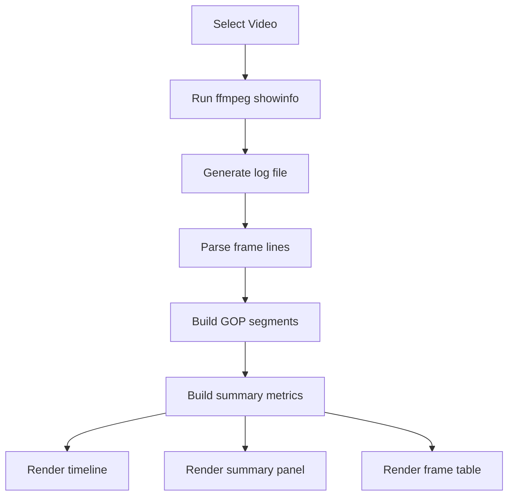
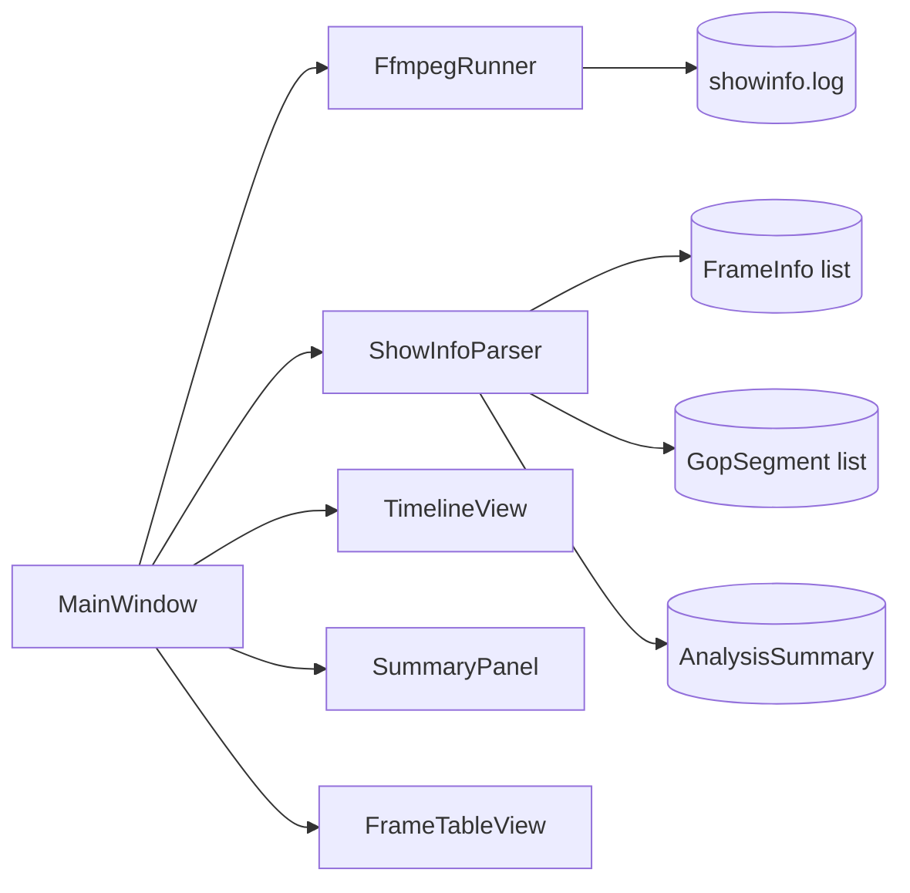
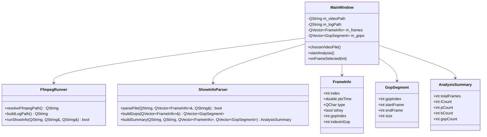

# Diagrams

## Workflow

```mermaid
flowchart TD
    A[Select Video] --> B[Run ffmpeg showinfo]
    B --> C[Generate log file]
    C --> D[Parse frame lines]
    D --> E[Build GOP segments]
    E --> F[Build summary metrics]
    F --> G[Render timeline]
    F --> H[Render summary panel]
    F --> I[Render frame table]
```

## Runtime Architecture

```mermaid
graph LR
    MW[MainWindow] --> FR[FfmpegRunner]
    MW --> SP[ShowInfoParser]
    MW --> TV[TimelineView]
    MW --> SM[SummaryPanel]
    MW --> FT[FrameTableView]

    FR --> LOG[(showinfo.log)]
    SP --> M1[(FrameInfo list)]
    SP --> M2[(GopSegment list)]
    SP --> M3[(AnalysisSummary)]
```

## Class Diagram

```mermaid
classDiagram
    class MainWindow {
      -QString m_videoPath
      -QString m_logPath
      -QVector~FrameInfo~ m_frames
      -QVector~GopSegment~ m_gops
      +chooseVideoFile()
      +startAnalysis()
      +onFrameSelected(int)
    }

    class FfmpegRunner {
      +resolveFfmpegPath() QString
      +buildLogPath() QString
      +runShowInfo(QString, QString&, QString&) bool
    }

    class ShowInfoParser {
      +parseFile(QString, QVector~FrameInfo~&, QString&) bool
      +buildGops(QVector~FrameInfo~&) QVector~GopSegment~
      +buildSummary(QString, QString, QVector~FrameInfo~, QVector~GopSegment~) AnalysisSummary
    }

    class FrameInfo {
      +int index
      +double ptsTime
      +QChar type
      +bool isKey
      +int gopIndex
      +int indexInGop
    }

    class GopSegment {
      +int gopIndex
      +int startFrame
      +int endFrame
      +int size
    }

    class AnalysisSummary {
      +int totalFrames
      +int iCount
      +int pCount
      +int bCount
      +int gopCount
    }

    MainWindow --> FfmpegRunner
    MainWindow --> ShowInfoParser
    MainWindow --> FrameInfo
    MainWindow --> GopSegment
    MainWindow --> AnalysisSummary
```
